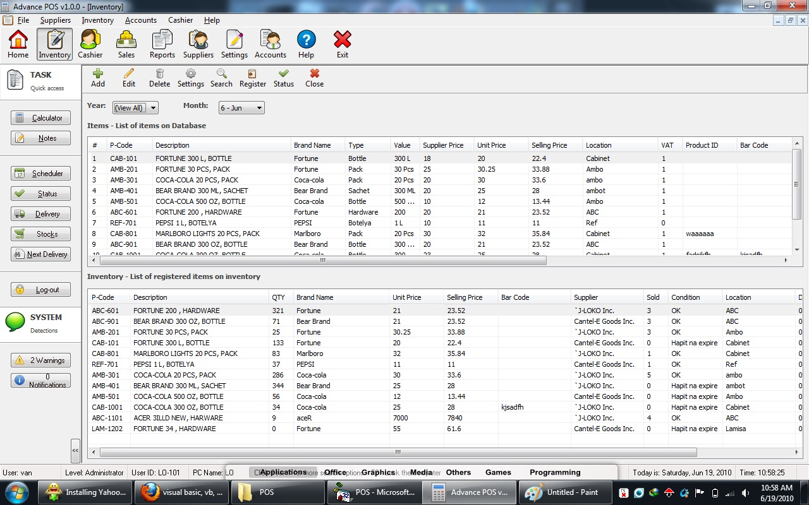



## Advance POS \(Full\)

### Description

Advance POS. Complete codes.. download needed components here and run the components.bat; http://www.fileden.com/files/2006/9/5/203867/Components.zip
 
### More Info
 

             |
---                |---
**Submitted On**   |2010-06-19 10:58:44
**By**             |[Jovanni Lo](https://github.com/Planet-Source-Code/PSCIndex/blob/master/ByAuthor/jovanni-lo.md)
**Level**          |Intermediate
**User Rating**    |4.3 (30 globes from 7 users)
**Compatibility**  |VB 6\.0
**Category**       |[Databases/ Data Access/ DAO/ ADO](https://github.com/Planet-Source-Code/PSCIndex/blob/master/ByCategory/databases-data-access-dao-ado__1-6.md)
**World**          |[Visual Basic](https://github.com/Planet-Source-Code/PSCIndex/blob/master/ByWorld/visual-basic.md)
**Archive File**   |[Advance\_PO2183146182010\.zip](https://github.com/Planet-Source-Code/jovanni-lo-advance-pos-full__1-73219/archive/master.zip)

